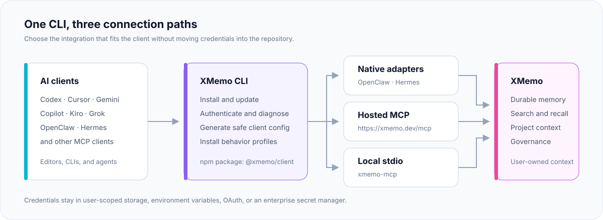
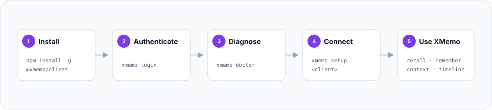

<div align="center">
  <a href="https://xmemo.dev">
    
  </a>

  <h1>XMemo CLI</h1>

  <p><strong>One private memory layer for every AI agent.</strong></p>
  <p>
    Install, authenticate, diagnose, and connect XMemo across editors,
    CLIs, and autonomous agents from one production-ready command line.
  </p>

  <p>
    <a href="https://github.com/yonro/memory-os-cli/actions/workflows/ci.yml"></a>
    <a href="https://www.npmjs.com/package/@xmemo/client"></a>
    <a href="https://www.npmjs.com/package/@xmemo/client"></a>
    <a href="https://www.npmjs.com/package/@xmemo/client"></a>
    <a href="./LICENSE"></a>
    <a href="https://github.com/yonro/memory-os-cli/stargazers"></a>
  </p>

  <p>
    <a href="https://modelcontextprotocol.io/"></a>
    <a href="https://xmemo.dev"></a>
    <a href="#security-by-default"></a>
    <a href="https://lobehub.com/mcp/yonro-memory-os-cli"></a>
    <a href="https://glama.ai/mcp/servers/yonro/memory-os-cli"></a>
  </p>

  <p>
    <a href="#quick-start">Quick start</a> ·
    <a href="#supported-integrations">Integrations</a> ·
    <a href="#connection-modes">Connection modes</a> ·
    <a href="#command-reference">Commands</a> ·
    <a href="#security-by-default">Security</a>
  </p>
</div>

---

`@xmemo/client` is the official control plane for connecting AI tools to
[XMemo](https://xmemo.dev). It makes setup repeatable, keeps credentials out of
project files, and gives every supported client a consistent path to durable,
user-owned memory.

The package is deliberately small: the CLI runtime, safe client configuration,
behavior profiles, XMemo skills, and marketplace metadata. Server code,
databases, deployment files, logs, and internal operations remain outside the
npm distribution.

## Architecture

<p align="center">
  
</p>

| | |
| --- | --- |
| **Package** | [`@xmemo/client`](https://www.npmjs.com/package/@xmemo/client) |
| **Primary command** | `xmemo` |
| **Local MCP command** | `xmemo-mcp` |
| **Hosted MCP** | `https://xmemo.dev/mcp` |
| **Runtime** | Node.js 20 or later |
| **License** | MIT |

## Why XMemo CLI

- **One control plane** — login, diagnostics, configuration, profiles, updates,
  and smoke checks share one predictable interface.
- **Private by design** — generated project configuration references a
  credential; it never embeds the credential value.
- **Native where it matters** — OpenClaw and Hermes use dedicated memory
  integrations instead of duplicating the same capability through MCP.
- **Portable everywhere else** — hosted Streamable HTTP MCP and local stdio
  cover modern editors, terminals, and agent runtimes.
- **Safe automation** — supported setup and removal paths offer preview,
  dry-run, or explicit confirmation before making changes.
- **Small supply-chain surface** — the npm package is governed by an explicit
  file allowlist and release provenance.

## Quick start

```bash
npm install -g @xmemo/client
xmemo login
xmemo doctor
xmemo setup codex
xmemo status
```

Replace `codex` with your client. Preview a configuration before writing it:

```bash
xmemo setup cursor --dry-run
```

<p align="center">
  
</p>

> [!TIP]
> Start with `xmemo login`, `xmemo doctor`, and `xmemo setup <client>`.
> Hand-edit MCP configuration only when a client has no verified setup path.

## Supported integrations

| Client | Recommended command | Connection |
| --- | --- | --- |
| **Codex** | `xmemo setup codex` | Hosted MCP + behavior profile |
| **Cursor** | `xmemo setup cursor` | Hosted MCP + behavior profile |
| **Copilot CLI** | `xmemo setup copilot` | Local authenticated proxy |
| **Gemini CLI** | `xmemo setup gemini` | Hosted MCP + OAuth |
| **Antigravity** | `xmemo setup antigravity` | Hosted MCP + OAuth |
| **OpenClaw** | `xmemo setup openclaw` | Native memory plugin + Skill |
| **Hermes** | `xmemo setup hermes` | Native memory provider |
| **Kiro** | `xmemo setup kiro` | Hosted MCP |
| **Grok** | `xmemo setup grok` | Hosted MCP |
| **Other MCP clients** | `xmemo mcp config --client generic` | Generated template |

The client registry also covers Windsurf, Cline, Continue, Claude Desktop,
Claude Code, Kimi Code, Zed, JetBrains, OpenCode, Qwen, Trae, and compatible
MCP hosts. Run `xmemo mcp list` for the current machine-readable catalog.

## Connection modes

### Hosted MCP

The recommended universal path is the XMemo Streamable HTTP endpoint:

```text
https://xmemo.dev/mcp
```

OAuth-capable clients complete authentication in the browser. Other clients
reference `XMEMO_KEY` without copying its value into repository files.

Generic configuration shape:

```json
{
  "mcpServers": {
    "XMemo": {
      "type": "streamable-http",
      "url": "https://xmemo.dev/mcp",
      "headers": {
        "Authorization": "Bearer ${XMEMO_KEY}"
      }
    }
  }
}
```

Client configuration keys differ; prefer `xmemo setup <client>` over copying
this generic example directly.

### Local stdio MCP

`xmemo-mcp` is the dedicated stdio entry point for marketplaces and clients
that launch a local process. Safe discovery exposes 20 tools, three prompts,
and two documentation resources without a token. Tool execution still requires
authentication.

After a global installation:

```bash
xmemo-mcp
```

Install-free MCP configuration:

```json
{
  "mcpServers": {
    "XMemo": {
      "command": "npx",
      "args": [
        "-y",
        "--package",
        "@xmemo/client@latest",
        "xmemo-mcp"
      ]
    }
  }
}
```

`xmemo mcp serve` is equivalent when the CLI is already installed.

### Native integrations

OpenClaw and Hermes have dedicated memory providers. Their default setup avoids
installing a second, duplicate XMemo tool surface.

```bash
# Native OpenClaw plugin + XMemo Skill
xmemo setup openclaw

# Native Hermes memory provider
xmemo setup hermes
```

Add hosted MCP only when an explicit fallback is desired:

```bash
xmemo setup openclaw --with-mcp
xmemo setup hermes --with-mcp
```

Use `--mcp-only` to skip the native integration and install only the hosted MCP
fallback.

## Authentication

### Browser login

Recommended for personal accounts:

```bash
xmemo login
xmemo auth status
```

The CLI uses the hosted device-login flow, waits for browser approval, and
asks once before storing the issued credential unencrypted in the current
user's XMemo config directory. The exact path is shown before approval, file
permissions are restricted where the operating system supports it, and the
credential value is never printed. Prefer `XMEMO_KEY` or a managed secret store
on shared systems.

For non-interactive automation, record the same decision explicitly:

```bash
xmemo login --allow-plaintext
```

### Existing token

Pipe an existing token through stdin so it does not appear in command history:

```bash
printf '%s\n' 'your-token' | xmemo token add --from-stdin --allow-plaintext
xmemo token status --verify
```

PowerShell:

```powershell
$xmemoToken = Read-Host "XMemo token"
$xmemoToken | xmemo token add --from-stdin --allow-plaintext
Remove-Variable xmemoToken
```

For CI and managed workstations, expose `XMEMO_KEY` through the platform's
secret manager. Do not commit it to `.env`, MCP configuration, logs, issue
reports, or chat transcripts.

## Command reference

<details>
<summary><strong>Lifecycle and diagnostics</strong></summary>

```bash
xmemo --version
xmemo update
xmemo update --dry-run
xmemo doctor
xmemo discovery show
xmemo status
xmemo privacy
```

</details>

<details>
<summary><strong>Authentication</strong></summary>

```bash
xmemo login
xmemo auth status
xmemo auth-status --verify
xmemo token status --verify
xmemo token add --from-stdin --allow-plaintext
xmemo env example --shell bash
```

</details>

<details>
<summary><strong>Client setup</strong></summary>

```bash
xmemo setup <client>
xmemo setup <client> --dry-run
xmemo setup --all
xmemo setup openclaw [--with-mcp|--mcp-only]
xmemo setup hermes [--with-mcp|--mcp-only]
```

</details>

<details>
<summary><strong>MCP and behavior profiles</strong></summary>

```bash
xmemo mcp serve
xmemo mcp list
xmemo mcp config --client generic
xmemo mcp add <client> --write
xmemo mcp proxy
xmemo profile install <client>
xmemo profile status <client>
xmemo profile uninstall <client>
xmemo smoke --client codex
```

</details>

<details>
<summary><strong>Safe removal</strong></summary>

```bash
xmemo uninstall <client> --dry-run
xmemo uninstall <client> --yes
xmemo uninstall --all --dry-run
xmemo uninstall --all --yes --profiles
```

Only XMemo-owned entries and marker-scoped behavior profiles are removed.
Unrelated MCP servers, credentials, and device identity remain intact.

</details>

Run `xmemo help` or `xmemo <command> --help` for complete, version-matched
options.

## Client notes

<details>
<summary><strong>Codex and Cursor</strong></summary>

```bash
xmemo setup codex
xmemo smoke --client codex

xmemo setup cursor
```

Both setup paths write a user-scoped MCP entry and can install a marker-scoped
memory behavior profile. Use `--no-profile` to configure MCP only. Cursor's
public marketplace plugin remains OAuth-first and contains no bearer-token
configuration.

</details>

<details>
<summary><strong>Gemini CLI and Antigravity</strong></summary>

```bash
xmemo setup gemini
xmemo setup antigravity
```

These clients use hosted MCP OAuth. Their generated configuration carries no
token value; restart the client and complete the browser login on first use.

</details>

<details>
<summary><strong>OpenClaw</strong></summary>

```bash
xmemo login
xmemo setup openclaw
openclaw xmemo status
```

The setup command installs or updates `@xmemo/openclaw-memory`, installs the
XMemo Skill, reuses the shared XMemo credential, and checks plugin status.

</details>

<details>
<summary><strong>Hermes</strong></summary>

```bash
xmemo login
xmemo setup hermes
```

The setup command installs or updates `hermes-xmemo`, configures the native
provider, and synchronizes the user-scoped XMemo credential with Hermes.

</details>

<details>
<summary><strong>Copilot CLI</strong></summary>

```bash
xmemo login
xmemo setup copilot
xmemo mcp proxy
```

Copilot CLI receives a local proxy entry. The proxy reads the credential from
user-scoped storage, adds identity metadata, and forwards requests to hosted
MCP without writing secrets into Copilot configuration.

</details>

## Security by default

| Control | Default behavior |
| --- | --- |
| **Telemetry** | No CLI analytics or usage telemetry |
| **Credential output** | Token values are never printed |
| **Project files** | Generated configuration references secrets; it does not embed them |
| **Discovery** | `doctor`, `discovery show`, and public capability discovery send no token |
| **Identity** | One stable, non-secret agent-instance ID is stored outside git |
| **Writes** | Setup supports preview/dry-run; broad removal requires confirmation |
| **Local credential storage** | Interactive login asks first; non-interactive writes require `--allow-plaintext`; stored tokens are unencrypted |
| **Package contents** | An npm `files` allowlist excludes tests, operations, logs, and server code |

Credential precedence and compatibility aliases are documented by:

```bash
xmemo env example --shell bash
xmemo privacy
```

For private or self-hosted deployments, set `XMEMO_URL` or pass
`--url <service-url>`. `MEMORY_OS_URL` remains a compatibility alias.

## Package boundary

Published to npm:

```text
bin/
docs/assets/
src/
skills/
plugins/kiro/
plugins/xmemo/
README.md
LICENSE
```

Not published:

```text
.github/
docs/analysis/
docs/architecture/
test/
coverage/
server code
database migrations
deployment files
logs and local state
```

## Development

```bash
npm install
npm run release:check
npm run lint
npm test
npm run pack:dry-run
```

Before proposing a release, run the complete package gate:

```bash
npm run prepublishOnly
```

The local stdio server can be inspected directly:

```bash
node bin/mcp-stdio.js
```

## Release model

Normal releases are produced by GitHub Actions from the exact tagged commit,
not from a mutable branch checkout or a developer workstation:

```text
develop → CLI version sync → test → cli-v tag → GitHub Actions → npm publish --provenance
```

The CLI package and hosted MCP service intentionally have separate version
streams:

- CLI/npm version: `package.json`, `package-lock.json`, and the npm package
  entry in `server.json`.
- Hosted MCP/Registry version: the top-level `server.json.version` and
  `lhm.plugin.json`. This version follows the deployed XMemo service.

`node scripts/check-release-version.mjs` verifies both contracts. A
`cli-vX.Y.Z` tag must equal the CLI/npm version and publishes only npm. The
MCP Registry is published separately with the `Publish MCP Registry metadata`
workflow using `mcp-vX.Y.Z`, which must equal the hosted MCP/Registry version.
The separate npm publish workflow is manual recovery only, so creating a
GitHub Release cannot publish twice.

## Documentation and support

Canonical service documentation lives at [xmemo.dev/docs](https://xmemo.dev/docs/quickstart).
This repository documents the client; the pages below document the hosted service
it connects to.

| | |
| --- | --- |
| **Quickstart** | [xmemo.dev/docs/quickstart](https://xmemo.dev/docs/quickstart) |
| **MCP overview and per-client setup** | [xmemo.dev/docs/mcp/overview](https://xmemo.dev/docs/mcp/overview) |
| **Tool reference** (`remember`, `recall`, `search`, …) | [xmemo.dev/docs/tools/remember](https://xmemo.dev/docs/tools/remember) |
| **REST API** | [xmemo.dev/docs/api/authentication](https://xmemo.dev/docs/api/authentication) |
| **Troubleshooting** | [xmemo.dev/docs/troubleshooting](https://xmemo.dev/docs/troubleshooting) |
| **Machine-readable index** | [xmemo.dev/llms.txt](https://xmemo.dev/llms.txt) |

- [XMemo](https://xmemo.dev)
- [MCP server reference](./MCP-README.md)
- [Adding a new client](./ADDING_CLIENTS.md)
- [Issues](https://github.com/yonro/memory-os-cli/issues)
- [Releases](https://github.com/yonro/memory-os-cli/releases)

## License

[MIT](./LICENSE) © 2025–2026 Yonro
