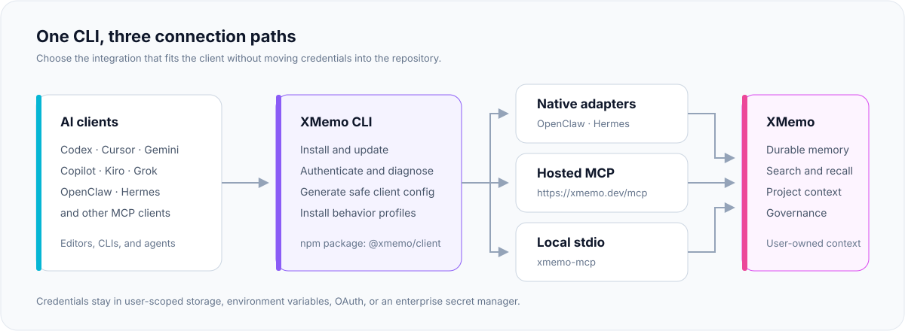
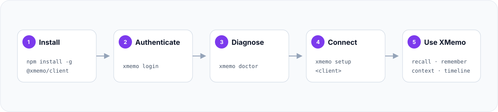

# XMemo CLI

[](https://xmemo.dev)

**为每一个 AI 智能体打造的私有统一记忆层。**

通过一个生产就绪的命令行工具，在各类编辑器、CLI 与自主智能体之间完成 XMemo 的安装、认证、诊断与无缝连接。

[](https://github.com/yonro/memory-os-cli/actions/workflows/ci.yml)
[](https://www.npmjs.com/package/@xmemo/client)
[](https://clawhub.ai/skill/xmemo)
[](https://www.npmjs.com/package/@xmemo/client)
[](https://www.npmjs.com/package/@xmemo/client)
[](./LICENSE)
[](https://github.com/yonro/memory-os-cli)
[](https://modelcontextprotocol.io/)
[](https://xmemo.dev)
[](#默认安全隐私原则)
[](https://lobehub.com/mcp/yonro-memory-os-cli)
[](https://glama.ai/mcp/servers/yonro/memory-os-cli)

[English](README.md) · [简体中文](README_CN.md)

[快速开始](#快速开始) · [集成列表](#支持的客户端集成) · [连接模式](#连接模式) · [插件系统](#智能体插件) · [命令大全](#命令参考) · [版本说明](#版本说明) · [安全与隐私](#默认安全隐私原则)

---

`@xmemo/client` 是将各类 AI 工具连接到 [XMemo](https://xmemo.dev) 的官方控制面。它让配置具备可重现性，防止敏感凭据硬编码进项目文件，并为所有受支持的客户端提供统一、持久且用户私有的记忆接入路径。

本 npm 包体积极其精简：仅包含 CLI 运行时、安全的客户端配置生成器、行为规范配置（Profiles）、XMemo Skill 以及市场分发元数据。服务端代码、数据库、部署脚本、运行时日志和内部运维模块均排除在 npm 分发包之外。

## 架构概览



| | |
| --- | --- |
| **NPM 包名** | [`@xmemo/client`](https://www.npmjs.com/package/@xmemo/client) |
| **主命令** | `xmemo`（别名：`client`） |
| **本地 MCP 命令** | `xmemo-mcp` |
| **托管版 MCP** | `https://xmemo.dev/mcp` |
| **运行环境** | Node.js 20 或更高版本 |
| **开源协议** | MIT |

## 为什么选择 XMemo CLI

- **统一控制面** — 登录、诊断、配置、Profile 管理、更新与冒烟测试均共享一致且直观的操作界面。
- **默认注重隐私** — 生成的项目配置仅引用凭据名称（如环境变量），绝不会明文内嵌凭据密钥。
- **关键场景原生接入** — OpenClaw 与 Hermes 采用专有记忆提供者插件，避免通过 MCP 带来冗余工具层。
- **通用环境便携连接** — 托管 Streamable HTTP MCP 与本地 stdio 模式覆盖主流现代编辑器、终端与自主智能体运行时。
- **安全自动化机制** — 支持的配置与卸载命令均提供预览（preview）、预检（dry-run）或二次确认。
- **精简的供应链表面** — npm 发行包受严格的文件白名单与发布溯源（provenance）管控。

## 快速开始

### 全局安装

```bash
npm install -g @xmemo/client
xmemo login
xmemo doctor
xmemo setup codex
xmemo status
```

全局安装后主要使用 `xmemo` 命令，同时也提供 `client` 与 `memory-os` 作为等价别名。

### 使用 npx 即时执行

无需全局安装，亦可直接使用 `npx @xmemo/client <command>` 执行任意 CLI 命令：

```bash
# 查看版本或执行健康检查
npx @xmemo/client --version
npx @xmemo/client doctor

# 安装 Skill 或启动 MCP stdio 服务
npx @xmemo/client skill install
npx skills add yonro/memory-os-cli --skill xmemo-memory
npx @xmemo/client mcp serve
```

将 `codex` 替换为你正在使用的客户端。在实际写入配置前可先通过预览检查变更：

```bash
xmemo setup cursor --dry-run
```

### 引导式初次运行 (`xmemo init`)

首次使用时，可运行交互式向导，统一完成账号登录、客户端检测、智能体行为指令配置、MCP 服务器配置、Skill 安装以及各平台插件安装：

```bash
xmemo init
```

常用选项：
- `xmemo init --dry-run`: 仅生成并展示完整的初始化计划，不发出外部网络请求也不写入任何磁盘文件。
- `xmemo init --yes`: 自动确认并执行所有建议步骤（无需每次单独交互确认）。
- `xmemo init --json`: 输出机器可读的结构化 JSON 格式计划或执行结果信封。
- `xmemo init --client <id>...`: 仅对指定的客户端进行检测与配置（如 `cursor`、`codex`、`claude-code`）。
- `xmemo start`: `xmemo init` 的等价别名，结尾包含快速上手指导。



> [!TIP]
> 推荐的标准接入顺序：`xmemo login` → `xmemo doctor` → `xmemo setup <client>`。
> 仅在客户端暂无官方自动化适配方案时，才建议手动修改 MCP 配置文件。

## 支持的客户端集成

| 客户端 | 推荐配置命令 | 连接方式 |
| --- | --- | --- |
| **Codex** | `xmemo setup codex` | 托管 MCP + 行为规范 Profile |
| **Cursor** | `xmemo setup cursor` | 托管 MCP + Bearer Token + 行为规范 Profile |
| **Copilot CLI** | `xmemo setup copilot` | 本地认证代理 (Local authenticated proxy) |
| **Gemini CLI** | `xmemo setup gemini` | 托管 MCP + OAuth |
| **Antigravity** | `xmemo setup antigravity` | 托管 MCP + OAuth |
| **OpenClaw** | `xmemo setup openclaw` | 原生记忆插件 + 配套 Skill |
| **Hermes** | `xmemo setup hermes` | 原生记忆提供者 |
| **Kiro** | `xmemo setup kiro` | 原生 HTTP OAuth；`--auth key` 切换为 API Key |
| **Grok** | `xmemo setup grok` | 托管 MCP |
| **其他 MCP 客户端** | `xmemo mcp config --client generic` | 通用配置模板生成 |

客户端注册表同时还支持 Devin Desktop (formerly Windsurf)、Cline、Continue、Claude Desktop、Claude Code、Kimi Code、Zed、JetBrains、OpenCode、Qwen、Trae 等众多兼容 MCP 宿主。运行 `xmemo mcp list` 可获取当前完整的机器可读目录。

VS Code 用户如需专用编辑器扩展插件，请参阅 [yonro/xmemo-vscode](https://github.com/yonro/xmemo-vscode) 仓库。
Cursor 用户如需专用编辑器插件，请参阅 [yonro/xmemo-cursor-plugin](https://github.com/yonro/xmemo-cursor-plugin) 仓库。
Claude 用户如需专用插件，请参阅 [yonro/xmemo-claude-plugin](https://github.com/yonro/xmemo-claude-plugin) 仓库。

## 连接模式

### 托管版 MCP

推荐且通用的接入方式是使用 XMemo Streamable HTTP 端点：

```text
https://xmemo.dev/mcp
```

具备 OAuth 能力的客户端可在浏览器中直接完成认证。其他客户端引用环境变量 `XMEMO_KEY`，无需将密钥复制到代码仓库文件中。

通用配置结构示例：

```json
{
  "mcpServers": {
    "XMemo": {
      "type": "streamable-http",
      "url": "https://xmemo.dev/mcp",
      "headers": {
        "Authorization": "Bearer ${XMEMO_KEY}"
      }
    }
  }
}
```

各客户端配置文件的层级与键名有所不同；优先建议使用 `xmemo setup <client>` 命令进行自动注入。

### 本地 stdio MCP

`xmemo-mcp` 是专为插件市场和需要拉起本地子进程的宿主准备的 stdio 入口。即使未输入 Token，安全的轻量探测也会公开 20 个工具、3 个提示词（prompts）与 2 个文档资源（resources）。但工具的实际执行必须进行身份认证。

全局安装后直接调用：

```bash
xmemo-mcp
```

免全局安装的 npx 配置示例：

```json
{
  "mcpServers": {
    "XMemo": {
      "command": "npx",
      "args": [
        "-y",
        "--package",
        "@xmemo/client@latest",
        "xmemo-mcp"
      ]
    }
  }
}
```

CLI 全局安装后，`xmemo mcp serve` 效果与上述相同。

### 原生集成模式

OpenClaw 和 Hermes 拥有定制的原生记忆提供者插件。默认配置会自动避开创建重复的 MCP 工具外挂层：

- **OpenClaw**: 默认安装版本锁定的插件 `clawhub:@xmemo/openclaw-memory@1.0.18`，不携带 `--force` 参数。重复执行时会自动检测已安装状态；如需重新安装或覆盖，请显式传入 `--force`。
- **Hermes**: 默认通过 `pip install` 安装版本锁定的提供者包 `hermes-xmemo==1.1.3`，不携带 `-U` 参数。
- 所有安装命令在执行前都会打印出确切运行的命令与包规约；使用 `--dry-run` 预览将要执行的操作而不实际运行。

```bash
# 原生 OpenClaw 插件 (clawhub:@xmemo/openclaw-memory@1.0.18) + XMemo Skill
xmemo setup openclaw

# 原生 Hermes 记忆提供者 (hermes-xmemo==1.1.3)
xmemo setup hermes
```

仅在确需备用回退路径时，才添加托管 MCP：

```bash
xmemo setup openclaw --with-mcp
xmemo setup hermes --with-mcp
```

传入 `--mcp-only` 则跳过原生插件安装，仅配置托管 MCP。

### XMemo Skill 本地安装
 
CLI 支持将经过官方完整性校验的 XMemo Skill 安装至各智能体专属技能目录或指定目录：
 
- 支持安装至客户端技能目录：
  - **Claude Code**: `~/.claude/skills/xmemo-memory` (全局) 或 `.claude/skills/xmemo-memory` (传入 `--project` 时基于项目目录)
  - **Codex**: `~/.codex/skills/xmemo-memory`
  - **OpenClaw**: `~/.openclaw/skills/xmemo-memory`
  - 其余 21 款客户端在官方文档明确前均设为 `null`
- 默认安装 npm 上锁定的 `@xmemo/skill@1.1.33` 版本，并在解压前严格校验 tarball 完整性哈希（sha512 SRI）。
- 可通过 `--version <semver>` 指定特定版本，或显式传入 `--version latest` 获取最新版本。
- 在离线或内网隔离环境中，可通过 `--from <dir|tgz>` 从本地目录或打好的 tarball 进行离线安装（支持 `--integrity <sha512>`）。
- 支持通过 `skill status` 查看安装状态，通过 `skill update` 快捷更新，通过 `skill remove` 干净移除。
- 传入 `--dry-run` 预览安装计划而不写入任何文件。
- **安全与授权保障**：
  - 交互模式下默认展示写入目标并提示 `[y/N]`（回车、EOF 或空输入默认取消），除非显式指定 `--yes`。
  - 目标目录已存在时默认拒绝覆盖；指定 `--force` 覆盖前会自动在 `~/.xmemo/backups/skills/<client>/` 保留备份（独立于智能体技能目录，避免重复加载）。
  - `skill remove` 仅允许删除经过校验的 XMemo Skill 目录，严禁误删其他外部目录，并提示已保留的备份路径。
 
```bash
# 安装至智能体技能目录 (Claude Code 全局、Codex 或 OpenClaw)
xmemo skill install --client claude-code
xmemo skill install --client codex
xmemo skill install --client openclaw

# 安装至项目级技能目录 (Claude Code: .claude/skills/xmemo-memory)
xmemo skill install --client claude-code --project

# 一键为所有已检测到的受支持智能体安装
xmemo skill install --all

# 默认安装至当前目录 (./xmemo-skill)
xmemo skill install
xmemo skill install --dir ./custom-skill-dir

# 非交互式直接执行（跳过 [y/N] 确认提示）
xmemo skill install --client codex --yes

# 覆盖已有安装（自动在 ~/.xmemo/backups/skills/<client>/ 创建备份）
xmemo skill install --client codex --force --yes

# 快捷更新别名（等价于 skill install --force）
xmemo skill update --client codex --yes

# 查看各客户端技能安装状态与版本
xmemo skill status
xmemo skill status --client codex
xmemo skill status --all --json

# 安全卸载移除技能（拒绝删除非 XMemo 目录）
xmemo skill remove --client codex --yes
xmemo skill remove --client claude-code --project --yes

# Dry run 预览
xmemo skill install --client codex --dry-run
```

### 智能体插件

CLI 随 `@xmemo/client` 内置了经过官方验证的静态插件索引，每个插件条目均明确固定了发布版本、Release Tag 以及发布时刻解析的准确 Git Commit SHA。

| 插件 ID | 平台 / 智能体 | 类型 (Kind) | 状态 | 安装方式 |
| --- | --- | --- | --- | --- |
| `openclaw` | OpenClaw | `native-cli` | Stable | `openclaw plugins install clawhub:@xmemo/openclaw-memory@1.0.18` |
| `hermes` | Hermes Agent | `native-cli` | Stable | `python -m pip install hermes-xmemo==1.1.3` |
| `claude-code` | Claude Code | `git-dir` | Preview | Pinned Git clone 校验 commit `5d0d280` (默认安装至 `~/.xmemo/plugins/claude-code`) |
| `cursor` | Cursor | `marketplace` | Preview | Cursor 插件市场安装 |
| `gemini-cli` | Gemini CLI | `native-cli` | Preview | `gemini extensions install` 扩展安装 (unpinned: 宿主暂不支持指定版本/ref) |
| `kiro` | Kiro | `manual` | Preview | Steering 规则与 Power 配置 |
| `vscode` | VS Code | `marketplace` | Preview | VS Code 插件市场扩展 |
| `deepseek-dsh` | DeepSeek DSH | `native-cli` | Preview | `dsh plugin add dsh-xmemo` |
| `chatgpt-codex` | ChatGPT / Codex | `marketplace` | Preview | ChatGPT & Codex 扩展 |
| `cindy` | Cindy | `manual` | Preview | 原生智能体记忆接入 |
| `codex` | Codex | `mcp` | Preview | 专属 MCP 配置 (`xmemo setup codex`) |

插件命令：

```bash
# 列出可用插件（默认隐藏 legacy 归档插件）
xmemo plugin list

# 包含已归档的历史插件
xmemo plugin list --all

# 查看插件详情与验证元数据
xmemo plugin info <id>

# 预览安装计划（不执行任何操作）
xmemo plugin install <id> --dry-run

# 交互式确认安装（默认提示 [y/N]，回车或中断默认取消）
xmemo plugin install <id>

# 免交互确认直接安装
xmemo plugin install <id> --yes

# 指定自定义目录安装 git-dir 插件
xmemo plugin install claude-code --yes --dir ~/.custom-plugins/claude-code

# 在浏览器中打开插件主页或文档
xmemo plugin install <id> --open

# 检查各插件安装状态
xmemo plugin status [<id>]
```

**安全与授权原则：**
- 仅接受静态索引中登记的插件 ID；坚决拒绝任意外部 URL 或未经验证的插件名称（返回非零退出码 2）。
- 交互式安装默认打印执行计划并要求用户显式确认（`[y/N]`，空输入、回车或 EOF 均默认为取消）。
- `--dry-run` 承诺不产生任何文件写入或子进程调用。
- 市场与手动插件在执行 `plugin install <id>` 时展示来自上游仓库的精确分步操作指南（支持 `--open` 浏览器直达）。
- Git 目录插件（`claude-code`）默认安装至稳定用户目录（`~/.xmemo/plugins/<id>`），支持 `--dir <path>` 自定义目录覆盖；克隆后必须通过 `git rev-parse HEAD` 逐字节比对 Commit SHA，验证通过后打印确切的加载命令（`claude --plugin-dir <dir>`）；若哈希不匹配，立即安全删除克隆目录并报错中止。
- 任何由 CLI 启动的外部插件子进程，均严格过滤并移除敏感凭据环境变量（`XMEMO_KEY`、`MEMORY_OS_MCP_TOKEN`、`XMEMO_TOKEN`），防止凭据外泄。

## 账号与身份认证

### 账号命令族（`account`）

通过 `account` 统一管理本地认证状态、凭据文件与令牌：

```bash
# 浏览器设备授权登录
xmemo account login

# 检查当前登录与认证状态
xmemo account status

# 远程验证凭据可用性
xmemo account status --verify

# 检查或配置 Token 凭据
xmemo account token status
printf '%s\n' 'your-token' | xmemo account token add --from-stdin --allow-plaintext

# 退出登录：移除 CLI 本地存储的 XMemo 凭据
xmemo account logout

# 非交互式安全退出
xmemo account logout --yes
```

#### 安全退出登录机制（`xmemo account logout`）
- **精准清理：** 仅删除 CLI 所有的用户级凭据文件（`~/.config/xmemo/credentials.json` 或 OS 配置目录）。
- **确认保护：** 优先打印将要删除的文件路径，交互模式下提示 `Proceed with logout? [y/N]`（默认取消），除非附带 `--yes`。
- **环境隔离：** 绝不改动任何客户端 MCP 配置文件（Cursor、Claude、VS Code 等）及智能体托管的 OAuth 会话。
- **隐私保护：** 任何模式下绝不输出 Token 明文。
- **自动化支持：** 在 `--json` 模式下强制要求 `--yes`，防止无人值守脚本误触发。

### 历史兼容别名

原有的认证命令作为向后兼容别名继续保留：
- `xmemo login`（等价于 `xmemo account login`）
- `xmemo auth status`（等价于 `xmemo account status`）
- `xmemo auth-status`（等价于 `xmemo account status`）
- `xmemo token <status|add|set>`（等价于 `xmemo account token <status|add|set>`)

在人类交互终端下，别名会在 `stderr` 打印一行弃用提示。使用 `--json` 或 `--help` 时会自动静默。

### 注入已有 Token

通过标准输入（stdin）传入现有 Token，避免留下 Shell 历史命令记录：

```bash
printf '%s\n' 'your-token' | xmemo account token add --from-stdin --allow-plaintext
xmemo account token status --verify
```

PowerShell 交互方式：

```powershell
$xmemoToken = Read-Host "XMemo token"
$xmemoToken | xmemo account token add --from-stdin --allow-plaintext
Remove-Variable xmemoToken
```

在 CI 自动化与受管工作站中，请通过系统的 Secret Manager 注入 `XMEMO_KEY`。切勿将其提交至 `.env`、MCP 配置文件、日志、Issue 或聊天上下文中。

### 全局统一 `--json` 支持

所有命令与子命令均原生支持 `--json` 输出：
- 执行成功：在 `stdout` 输出符合标准的 JSON 数据，退出码为 `0`。
- 执行失败：在 `stdout` 输出结构化错误信封 `{ schemaVersion, ok: false, command, data: null, error: { code, message, ... } }`，退出码为非 0（如参数或用法错误为 `2`，网络或内部错误为 `1`）。

## 命令参考

<details>
<summary><strong>生命周期与系统诊断</strong></summary>

```bash
xmemo --version [--json]
xmemo update [--dry-run] [--json]
xmemo doctor [--services [memory,dream,knowledge,cloud-skill]] [--base-url <url>] [--json]
xmemo discovery show [--json]
xmemo status [--url <url>] [--json]
xmemo privacy [--json]
xmemo skill install [--client <id>|--all] [--project] [--dir <path>] [--dry-run] [--yes] [--force] [--json]
xmemo skill status [--client <id>|--all] [--json]
xmemo skill remove --client <id> [--project] [--yes] [--json]
xmemo skill update [--client <id>|--all] [--yes] [--json]
```

</details>

<details>
<summary><strong>账号与认证管理</strong></summary>

```bash
xmemo account login [--base-url <url>] [--allow-plaintext] [--json]
xmemo account logout [--yes] [--json]
xmemo account status [--verify] [--base-url <url>] [--json]
xmemo account token status [--verify] [--json]
xmemo account token add --from-stdin --allow-plaintext [--json]
xmemo account token set --from-stdin [--allow-plaintext] [--json]
xmemo env example [--shell bash|powershell|cmd] [--json]

# 兼容别名（交互模式下在 stderr 输出一行弃用提示）
xmemo login
xmemo auth status
xmemo auth-status
xmemo token status
xmemo token add --from-stdin --allow-plaintext
```

</details>

<details>
<summary><strong>客户端配置向导</strong></summary>

```bash
xmemo setup <client>
xmemo setup <client> --dry-run
xmemo setup --all
xmemo setup openclaw [--with-mcp|--mcp-only]
xmemo setup hermes [--with-mcp|--mcp-only]
```

</details>

<details>
<summary><strong>智能体插件</strong></summary>

```bash
xmemo plugin list [--all] [--json]
xmemo plugin info <id> [--json]
xmemo plugin install <id> [--dry-run] [--yes] [--open] [--dir <path>] [--json]
xmemo plugin status [<id>] [--all] [--json]
```

</details>

<details>
<summary><strong>直接与 XMemo 云服务交互</strong></summary>

```bash
xmemo memory add --content "Remember this" --path notes/example --json
xmemo memory search "example" --json
xmemo context recall "resume this task" --include-knowledge --json
xmemo state save --current-task "ship the client" --next-action "run tests" --json
xmemo state restore --json
xmemo restart snapshot --json
xmemo restart restore --snapshot-id <snapshot-id> --json

xmemo knowledge add --base <base-id> --file ./guide.pdf --title "Guide" --json
xmemo knowledge search "setup" --base <base-id> --json
xmemo knowledge read <item-id> --json > knowledge-view.json
xmemo knowledge update <item-id> --text "Updated" --from knowledge-view.json --publish --yes --json

xmemo dream preview --wait --json
xmemo dream show <run-id> --json > dream-view.json
xmemo dream apply <run-id> --item <candidate-id> --from dream-view.json --yes --json

xmemo cloud-skill list --json
xmemo cloud-skill add --file ./SKILL.md --json
xmemo cloud-skill show <skill-id> --json > skill-view.json
xmemo cloud-skill update <skill-id> --from skill-view.json --file ./SKILL.md --json
xmemo cloud-skill run <skill-id> --input ./args.json --from skill-view.json --yes --json
```

所有直连云端服务的命令均支持统一的机器可读 JSON 输出封装。知识库更新、Dream 记忆整合应用以及 Cloud Skill 执行均采用 `readReceipt` 进行乐观锁防冲突，确保 CLI 绝不会静默覆盖新版本。可通过设置 `XMEMO_KNOWLEDGE_BASE_ID` 指定非交互默认知识库。如需对长篇知识库条目进行分页读取，可使用 `xmemo knowledge read <item-id> --from knowledge-view.json --offset <n>`。使用 `xmemo doctor --services --json` 可只读诊断知识库、Dream 与 Cloud Skill 状态。

登录时如需扩展权限作用域，可显式声明，例如：

```bash
xmemo login --scopes memory:read,memory:write,memory:restore,knowledge:read,knowledge:write
```

</details>

<details>
<summary><strong>MCP 与行为规范 Profiles</strong></summary>

```bash
xmemo mcp serve
xmemo mcp list
xmemo mcp config --client generic
xmemo mcp add <client> --write
xmemo mcp proxy
xmemo profile install <client>
xmemo profile status <client>
xmemo profile uninstall <client>
xmemo smoke --client codex
```

</details>

<details>
<summary><strong>安全卸载</strong></summary>

```bash
xmemo uninstall <client> --dry-run
xmemo uninstall <client> --yes
xmemo uninstall --all --dry-run
xmemo uninstall --all --yes --profiles
```

卸载仅会清理 XMemo 自有的配置项与打上标记的作用域 Profile。无关的第三方 MCP 服务、认证凭据和设备标识均会完整保留。

</details>

运行 `xmemo help` 或 `xmemo <command> --help` 可获取版本匹配的完整参数选项。

## 常用客户端集成说明

<details>
<summary><strong>Codex 与 Cursor</strong></summary>

```bash
xmemo setup codex
xmemo smoke --client codex

xmemo setup cursor
```

两者均写入用户级的 MCP 配置，并可选择安装特定标记的记忆行为规范 Profile。传入 `--no-profile` 可只配 MCP。Cursor 官方插件市场版本优先使用 OAuth，不包含 Bearer Token 配置。

</details>

<details>
<summary><strong>Gemini CLI 与 Antigravity</strong></summary>

```bash
xmemo setup gemini
xmemo setup antigravity
```

这些客户端采用托管 MCP OAuth。生成的配置中不包含任何 Token 明文；重启客户端并在首次触发工具调用时完成浏览器授权即可。

</details>

<details>
<summary><strong>OpenClaw</strong></summary>

```bash
xmemo login
xmemo setup openclaw
openclaw xmemo status
```

该命令会自动安装/更新 `@xmemo/openclaw-memory` 插件，安装配套 XMemo Skill，复用本地 XMemo 凭据，并验证插件连通性。

</details>

<details>
<summary><strong>Hermes</strong></summary>

```bash
xmemo login
xmemo setup hermes
```

该命令会自动安装/更新 `hermes-xmemo`，配置原生记忆提供者，并将用户级 XMemo 凭据同步至 Hermes。

</details>

<details>
<summary><strong>Copilot CLI</strong></summary>

```bash
xmemo login
xmemo setup copilot
xmemo mcp proxy
```

Copilot CLI 会被配置为连接本地安全代理。代理从受保护存储中读取凭据、附加身份元数据，并将请求转发至托管 MCP，无需在 Copilot 配置中硬编码密钥。

</details>

## 默认安全隐私原则

| 安全控制项 | 默认行为 |
| --- | --- |
| **遥测监控** | 绝无任何用户埋点、CLI 使用情况收集或分析上报 |
| **凭据输出** | 终端与日志中绝不打印 Token 明文 |
| **项目文件** | 生成的配置仅引用环境变量等凭据源，不内嵌密钥 |
| **服务发现** | `doctor`、`discovery show` 与公开能力发现绝不附带用户 Token |
| **设备身份** | 本地生成唯一且非敏感的实例 ID，存储于 git 仓库之外 |
| **写入安全** | setup 支持 preview/dry-run；大范围卸载强制二次确认 |
| **本地凭据存储** | 交互式登录明确征求用户同意；非交互写入需 `--allow-plaintext`；存储文件受系统级所有者权限保护 |
| **发布包边界** | npm `files` 白名单严格排除测试文件、运维脚本、日志与服务端源码 |

凭据优先级与兼容别名可通过以下命令查看：

```bash
xmemo env example --shell bash
xmemo privacy
```

对于私有化或自建部署服务，设置环境变量 `XMEMO_URL` 或在命令行传入 `--url <service-url>`。`MEMORY_OS_URL` 作为向后兼容别名保留。

## 发布包边界

发布至 npm 的内容：

```text
bin/
docs/assets/
src/
README.md
README_CN.md
LICENSE
```

严格排除在 npm 之外的内容：

```text
.github/
docs/analysis/
docs/architecture/
docs/design/
test/
coverage/
服务端代码 (Server code)
数据库迁移文件 (Database migrations)
部署脚本 (Deployment files)
日志与本地状态文件 (Logs & local state)
```

## 本地开发与测试

```bash
npm install
npm run release:check
npm run lint
npm test
npm run pack:dry-run
```

在发起版本发布 PR 之前，执行完整的门禁检查：

```bash
npm run prepublishOnly
```

本地 stdio 服务可直接启动调试：

```bash
node bin/mcp-stdio.js
```

## 版本说明

本仓库包含两个独立发布的产品，各自维护独立演进的版本线与标签规则：

- **CLI 工具（`@xmemo/client`）**：发布到 [npm](https://www.npmjs.com/package/@xmemo/client)。
  - 当前版本：由根目录 `package.json` 维护。
  - Git Tag 规则：`cli-v*`（历史版本截至 0.4.181 使用 `v0.4.xxx`）。
  - 可在 [npm (@xmemo/client)](https://www.npmjs.com/package/@xmemo/client) 查看版本与变更。
- **Skill 智能体技能（`xmemo`）**：发布到 [ClawHub](https://clawhub.ai/skill/xmemo) 并由 [xmemo.dev](https://xmemo.dev/v1/skill/package) 分发。
  - 当前版本：由 `skills/xmemo/scripts/xmemo-skill.mjs` 中的 `SKILL_VERSION` 维护。
  - Git Tag 规则：`skill-v*`。
  - 可在 [ClawHub (xmemo)](https://clawhub.ai/skill/xmemo) 查看版本与安装方式。Skill 版本的 GitHub Release 会显式标记为 `Latest`，以确保服务端与安装脚本的下载回退正常运作。

## 发布流水线模型

正式版本均由 GitHub Actions 在打上 tag 的特定提交上直接构建发布，绝不依赖可变分支或开发者个人工作区：

```text
develop → CLI 版本同步 → 测试门禁 → cli-v 标签 → GitHub Actions → npm publish --provenance
```

CLI 工具包与托管 MCP 服务保持独立的版本管理轨道：

- CLI/npm 版本：由 `package.json`、`package-lock.json` 与 `server.json` 中的 npm 条目定义。
- 托管 MCP/Registry 版本：由顶级 `server.json.version` 与 `lhm.plugin.json` 维护，随已部署的 XMemo 云服务演进。

`node scripts/check-release-version.mjs` 负责同时校验两套版本契约。打上 `cli-vX.Y.Z` 标签仅发布 npm 包；MCP Registry 则由独立的 `Publish MCP Registry metadata` 工作流通过 `mcp-vX.Y.Z` 触发发布。CLI npm 发布使用 OIDC 可信发布（`environment: npm`，`id-token: write`），不再使用静态 `NPM_TOKEN`。手动恢复工作流（`.github/workflows/publish.yml`）需在 npmjs.com 配置独立的可信发布条目。

## 文档与技术支持

权威官方文档请访问 [xmemo.dev/docs](https://xmemo.dev/docs/quickstart)。本仓库聚焦于客户端本身，云服务相关指南可参考：

| | |
| --- | --- |
| **快速起步** | [xmemo.dev/docs/quickstart](https://xmemo.dev/docs/quickstart) |
| **MCP 概览与各客户端指南** | [xmemo.dev/docs/mcp/overview](https://xmemo.dev/docs/mcp/overview) |
| **工具规范** (`remember`, `recall`, `search`, …) | [xmemo.dev/docs/tools/remember](https://xmemo.dev/docs/tools/remember) |
| **REST API 文档** | [xmemo.dev/docs/api/authentication](https://xmemo.dev/docs/api/authentication) |
| **常见问题排查** | [xmemo.dev/docs/troubleshooting](https://xmemo.dev/docs/troubleshooting) |
| **AI 可读索引** | [xmemo.dev/llms.txt](https://xmemo.dev/llms.txt) |

- [XMemo 官网](https://xmemo.dev)
- [MCP 服务端参考](./MCP-README.md)
- [接入新客户端指南](./ADDING_CLIENTS.md)
- [问题反馈 (Issues)](https://github.com/yonro/memory-os-cli/issues)
- [版本发布记录 (Releases)](https://github.com/yonro/memory-os-cli/releases)

## 开源协议

[MIT](./LICENSE) © 2025–2026 Yonro

### 修复现有 Kiro MCP 配置

运行 `xmemo doctor --client kiro --json` 可以在无需网络请求的情况下检查本地配置。
使用 `xmemo doctor --client kiro --fix` 可将识别到的旧版代理配置平滑迁移为原生 HTTP OAuth；或附带 `--auth key` 切换为携带 `Bearer ${XMEMO_KEY}` 的原生 HTTP 模式。修复过程会自动创建备份，保留无关服务器与客户端偏好，且绝不将密钥写入替换内容中。修复完成后请重启 Kiro 并发起一次真实的工具调用以完成验证。全新安装请使用 `xmemo setup kiro [--auth oauth|key]`。
